# 🍳 silog

- [Introduction](#introduction)
- [Examples](#examples)
- [History](#history)
- [License](#license)

## Introduction

[](https://pkg.go.dev/go.abhg.dev/log/silog)
[](https://github.com/abhinav/silog-go/actions/workflows/ci.yml)
[](https://codecov.io/gh/abhinav/silog-go)


silog is a terminal-friendly logging handler
for Go's standard log/slog package.

### Features

- Configurable colorful output
- Custom log levels
- Multi-line log attributes

## Examples

### Basic Levels

Built-in levels are demonstrated with their default color-coded styling.

```go
logger.Debug("Starting background task")
logger.Info("Server listening on :8080")
logger.Warn("Connection pool nearing capacity")
logger.Error("Failed to process request")
```

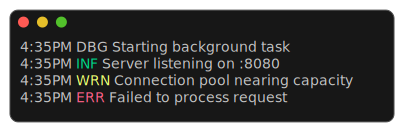

### Multiline Errors

Multi-line error messages are formatted with each line receiving the timestamp and level prefix.

```go
logger.Error("Database connection failed:\nConnection refused\n  at db.Connect()\n  at main.startup()")
```

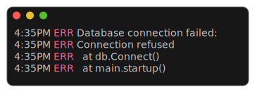

### Multiline Attributes

Multi-line attribute values are formatted with pipe-prefixed indentation for readability.

```go
logger.Info("Request completed",
	"sql", "SELECT *\nFROM users\nWHERE active = true",
	"duration", "45ms",
)
```

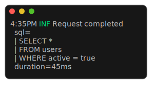

### Grouped Attributes

Nested grouped attributes are created using WithGroup and slog.Group, rendered with dot-notation for hierarchical attribute organization.

```go
logger := slog.New(handler).WithGroup("request").WithGroup("headers")

logger.Info("Incoming request",
	slog.Group("body",
		"method", "POST",
		"path", "/api/users",
	),
)
```

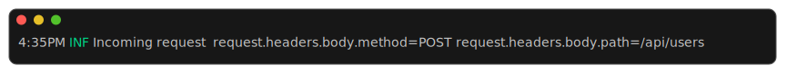

### Error Highlighting

The "error" attribute is automatically highlighted in red when using the default style.

```go
logger.Info("Operation failed",
	"error", "connection timeout",
	"retry_count", 3,
	"timeout", "30s",
)
```


### Prefixes

Handler-level prefixes are used to distinguish log messages posted by different subsystems or components.

```go
dbHandler := baseHandler.SetPrefix("database")
cacheHandler := baseHandler.SetPrefix("cache")

dbLogger := slog.New(dbHandler)
cacheLogger := slog.New(cacheHandler)

dbLogger.Info("Connection pool initialized")
cacheLogger.Warn("Cache miss rate high")
```

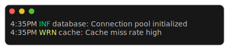

### Multiline Prefixes

Prefixes are preserved across multi-line messages, appearing on each line of output.

```go
log := slog.New(h.SetPrefix("worker"))

log.Info("Task completed:\n- Processed 1000 items\n- Generated 50 reports\n- Sent 25 notifications")
```

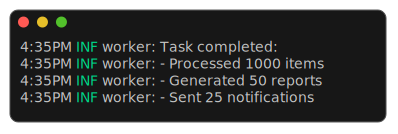

### Complex Example

A complex real-world example demonstrating combining multi-line error attributes, structured key-value pairs, and error highlighting.

```go
log.Error("API request failed",
	"method", "POST",
	"path", "/api/orders",
	"error", "validation failed:\n  - invalid email\n  - missing required field: address",
	"user_id", "12345",
	"duration", "125ms",
)
```

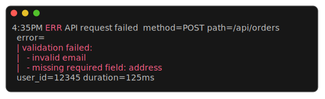

### With Attributes

The With method is used to pre-attach attributes for shared context across multiple log statements.

```go
requestLog := log.With("request_id", "abc-123", "user", "alice@example.com", "session", "xyz-789")

requestLog.Info("Request started")
requestLog.Info("Processing payment")
requestLog.Info("Request completed", "duration", "245ms")
```

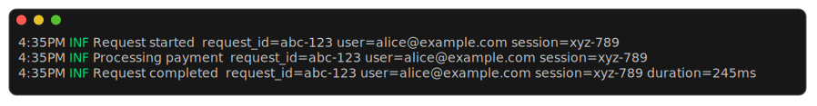

### Custom Level

A custom log level can be defined with its own label and message style.

```go
style.LevelLabels[LevelTrace] = renderer.NewStyle().SetString("TRC")
style.Messages[LevelTrace] = style.Messages[slog.LevelDebug]

logger.Log(context.Background(), LevelTrace, "Entering function")
```

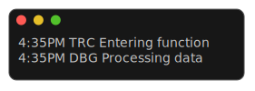

### Level Offset

WithLevelOffset dynamically downgrades log levels for testing or temporarily reducing log verbosity.

```go
offsetHandler := baseHandler.WithLevelOffset(-4)
logger := slog.New(offsetHandler)

logger.Error("This appears as WARNING")
logger.Warn("This appears as INFO")
logger.Info("This appears as DEBUG")
```

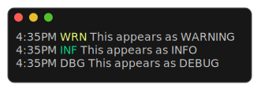

### Nested Multiline

Multi-line attribute values within deeply nested groups, show how formatting is preserved through multiple levels.

```go
logger := baseLogger.WithGroup("service").WithGroup("database")

logger.Info("Query executed",
	slog.Group("details",
		"query", "SELECT id, name\nFROM users\nORDER BY created_at",
		"rows", 42))
```

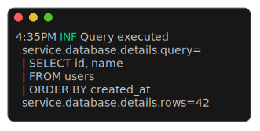

### No Time

ReplaceAttr can suppress the timestamp from log output.

```go
ReplaceAttr: func(groups []string, attr slog.Attr) slog.Attr {
	// Remove the time attribute from log output.
	if len(groups) == 0 && attr.Key == slog.TimeKey {
		return slog.Attr{}
	}
	return attr
},
```

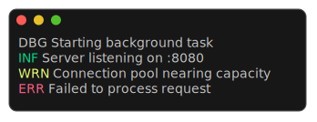

## History

This library was originally developed as part of
[git-spice](https://abhinav.github.io/git-spice/).
It's been extracted into a separate repository
to allow use from other projects.

## License

This software is made available under the BSD-3 license.
See LICENSE for the full license text.
